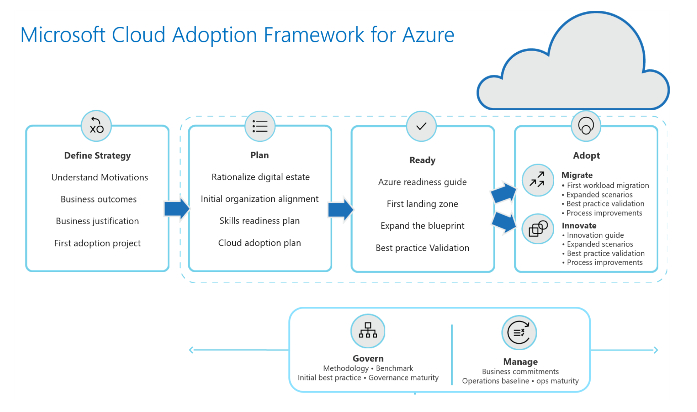

# Empower Cloud Adoption Framework ( CAF ) with DevOps at Microsoft

The Cloud Adoption Framework is the One Microsoft approach to cloud adoption in Azure, consolidating and sharing best practices from Microsoft employees, partners, and customers. The framework gives customers a set of tools, guidance, and narratives that help shape technology, business, and people strategies for driving desired business outcomes during their adoption effort. This guidance aligns to the following phases of the cloud adoption lifecycle, ensuring easy access to the right guidance at the right time.

## Cloud Adoption Framework ( CAF ) useful references : 

- CAF Documentation: https://aka.ms/caf
- CAF for AKS Documentation: https://aka.ms/kcaf 

## More details on my blog : 

Please go to my blog cloud-melon.com to get more details about how to implement this solution and more about Microsoft Azure ( ref link : https://cloud-melon.com )

